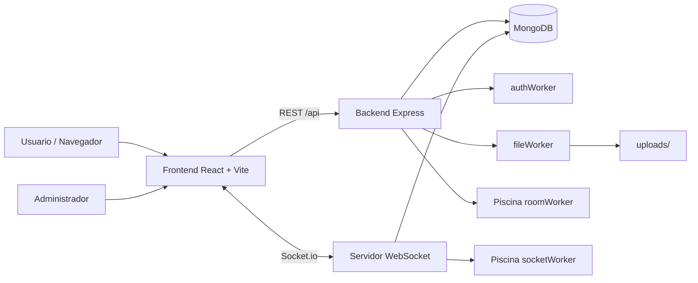

# Realtime Chat WebSockets

Sistema web de chat en tiempo real con salas seguras por PIN, panel de administracion, mensajes en vivo por WebSockets, soporte para archivos en salas multimedia y procesamiento concurrente con Worker Threads.

El proyecto esta separado en backend y frontend. El backend expone una API REST, un servidor Socket.io y pools de workers para tareas pesadas. El frontend ofrece una experiencia responsive tipo landing/app, modo claro/oscuro persistente y vistas optimizadas para escritorio y movil.

## Tabla de Contenido

- [Caracteristicas](#caracteristicas)
- [Stack](#stack)
- [Arquitectura](#arquitectura)
- [Estructura del Proyecto](#estructura-del-proyecto)
- [Requisitos Previos](#requisitos-previos)
- [Instalacion Rapida](#instalacion-rapida)
- [Variables de Entorno](#variables-de-entorno)
- [Como Usar la App](#como-usar-la-app)
- [API REST](#api-rest)
- [Eventos WebSocket](#eventos-websocket)
- [Salas TEXT vs MULTIMEDIA](#salas-text-vs-multimedia)
- [Pruebas](#pruebas)
- [Acceso desde Celular o Red Local](#acceso-desde-celular-o-red-local)
- [Troubleshooting](#troubleshooting)
- [Documentacion Complementaria](#documentacion-complementaria)

## Caracteristicas

- Chat en tiempo real con Socket.io.
- Creacion de salas privadas desde un panel administrador.
- PIN de sala hasheado con bcrypt y huella HMAC para detectar duplicados sin guardar el PIN en plano.
- Salas de tipo `TEXT` y `MULTIMEDIA`.
- En salas `MULTIMEDIA`: subida de imagenes `jpeg`, `jpg`, `png`, `gif` y archivos `pdf` hasta 10 MB.
- Historial de mensajes persistido en MongoDB.
- Usuarios anonimos por nickname, sin registro previo.
- Validacion de nickname unico dentro de cada sala.
- Control de sesion unica por IP/dispositivo dentro de una sala.
- Desconexion por inactividad despues de 30 minutos.
- Procesamiento concurrente con Piscina y Worker Threads.
- Frontend responsive con landing, panel admin, sala de chat, modo oscuro y modo claro.
- Tema persistente en `localStorage` usando React Context, sin prop drilling.
- Interfaz movil compacta: el composer cambia segun el tipo de sala.

## Stack

### Backend

- Node.js
- Express 5
- Socket.io 4
- MongoDB + Mongoose 9
- bcrypt
- jsonwebtoken
- multer
- Piscina
- Worker Threads
- Jest + Supertest

### Frontend

- React 19
- Vite 6
- Tailwind CSS 4
- react-router-dom 7
- axios
- SweetAlert2
- socket.io-client
- Font Awesome

## Arquitectura



El backend mantiene las sesiones activas en memoria mediante un `Map`, no en base de datos. MongoDB almacena salas, mensajes y metadatos de archivos.

## Estructura del Proyecto

```text
realtime-chat-websockets/
├── backend/
│   ├── main.js
│   ├── seed.js
│   ├── controllers/
│   ├── middlewares/
│   ├── models/
│   ├── routes/
│   ├── tests/
│   ├── uploads/
│   └── workers/
├── frontend/
│   ├── index.html
│   ├── vite.config.js
│   └── src/
│       ├── App.jsx
│       ├── assets/
│       ├── context/
│       └── components/
│           ├── atoms/
│           ├── molecules/
│           ├── organisms/
│           └── templates/
└── docs/
    ├── containers.md
    ├── requisitos.md
    └── datamodel/
```

## Requisitos Previos

- Node.js 18 o superior.
- npm.
- MongoDB local o en Docker.
- Git, si vas a clonar el repositorio.

## Instalacion Rapida

### 1. Clonar e instalar dependencias

```bash
git clone <url-del-repositorio>
cd realtime-chat-websockets

cd backend
npm install

cd ../frontend
npm install
```

### 2. Levantar MongoDB

Con MongoDB instalado localmente, verifica que este corriendo en `localhost:27017`.

Tambien puedes usar Docker:

```bash
docker run --name mongodb -d -p 27017:27017 mongo:latest
```

Si usas MongoDB con usuario y clave, revisa [docs/containers.md](./docs/containers.md).

### 3. Configurar variables de entorno

Crea `backend/.env` y `frontend/.env` siguiendo los ejemplos de la siguiente seccion.

### 4. Iniciar backend

```bash
cd backend
node main.js
```

El backend queda disponible en:

```text
http://localhost:3000
```

### 5. Iniciar frontend

En otra terminal:

```bash
cd frontend
npm run dev
```

El frontend queda disponible normalmente en:

```text
http://localhost:5173
```

## Variables de Entorno

### `backend/.env`

```env
PORT=3000
MONGO_URI=mongodb://localhost:27017/realtime-chat
JWT_SECRET=una_clave_larga_y_segura
ADMIN_USER=admin
ADMIN_PASS=admin123
PIN_PEPPER=otra_clave_larga_para_huella_de_pins
```

Notas importantes:

- `PIN_PEPPER` es obligatorio. Si no existe, el backend se detiene para evitar guardar PINs sin huella segura.
- `JWT_SECRET` se usa para firmar/verificar el token del administrador.
- `ADMIN_USER` y `ADMIN_PASS` definen las credenciales del panel admin.

### `frontend/.env`

```env
VITE_SOCKET_URL=http://localhost:3000
```

Notas importantes:

- La API REST usa rutas relativas `/api` y Vite las redirige al backend con el proxy configurado.
- `VITE_SOCKET_URL` se usa para la conexion Socket.io y para construir URLs de archivos subidos.

## Como Usar la App

### Flujo del administrador

1. Abre el frontend.
2. Entra a `/admin`.
3. Inicia sesion con las credenciales de `backend/.env`.
4. Entra al dashboard.
5. Crea una sala con:
   - Nombre.
   - PIN numerico de minimo 4 digitos.
   - Tipo: `TEXT` o `MULTIMEDIA`.
6. Comparte el PIN con los usuarios.

Por seguridad, el panel no lista el PIN en texto plano despues de crear la sala. El PIN se guarda hasheado en MongoDB.

### Flujo del usuario

1. Abre `/`.
2. Ingresa un nickname.
3. Ingresa el PIN de la sala.
4. Entra a `/room/:pin`.
5. Chatea en tiempo real.
6. Si la sala es `MULTIMEDIA`, tambien podra adjuntar imagenes o PDF.

### Datos de prueba

Puedes cargar datos iniciales:

```bash
cd backend
node seed.js
```

El seed limpia las colecciones y crea salas/mensajes de ejemplo. Requiere que `backend/.env` este configurado, incluyendo `PIN_PEPPER`.

## API REST

Base URL local:

```text
http://localhost:3000
```

| Metodo | Ruta | Auth | Descripcion |
|---|---|---|---|
| `GET` | `/` | No | Health check basico de la API. |
| `POST` | `/api/auth/login` | No | Login del administrador. |
| `POST` | `/api/rooms` | JWT | Crea una sala. |
| `GET` | `/api/rooms` | JWT | Lista salas. No expone el PIN hasheado. |
| `DELETE` | `/api/rooms/:id` | JWT | Elimina sala y mensajes asociados. |
| `GET` | `/api/rooms/:pin/messages` | No | Obtiene historial de una sala por PIN. |
| `POST` | `/api/upload` | No | Sube un archivo permitido. |

### Login admin

```http
POST /api/auth/login
Content-Type: application/json
```

```json
{
  "username": "admin",
  "password": "admin123"
}
```

Respuesta:

```json
{
  "message": "Autenticación exitosa (procesada en hilo independiente)",
  "token": "<jwt>"
}
```

### Crear sala

```http
POST /api/rooms
Authorization: Bearer <jwt>
Content-Type: application/json
```

```json
{
  "name": "Sala de soporte",
  "pin": "1234",
  "type": "TEXT"
}
```

Tipos permitidos:

- `TEXT`
- `MULTIMEDIA`

## Eventos WebSocket

La conexion se realiza contra:

```text
VITE_SOCKET_URL
```

Por defecto:

```text
http://localhost:3000
```

### Cliente a servidor

| Evento | Payload | Descripcion |
|---|---|---|
| `joinRoom` | `{ pin, user, force }` | Une al usuario a una sala si el PIN es valido. |
| `sendMessage` | `{ roomId, content, file }` | Envia mensaje de texto o mensaje con archivo. |
| `disconnect` | Automatico | Limpia la sesion en memoria. |

### Servidor a cliente

| Evento | Payload | Descripcion |
|---|---|---|
| `newMessage` | Mensaje | Broadcast del mensaje nuevo a la sala. |
| `userListUpdate` | `string[]` | Lista actualizada de usuarios conectados. |
| `force_disconnect` | Mensaje | Cierra una sesion anterior cuando se fuerza la entrada. |
| `inactivity_timeout` | Mensaje | Desconecta al usuario por inactividad. |

## Salas TEXT vs MULTIMEDIA

### Sala `TEXT`

- Solo muestra input de texto y boton de envio.
- No muestra boton de adjuntar archivo.
- Pensada para conversaciones simples y rapidas.

### Sala `MULTIMEDIA`

- Muestra boton de adjuntar archivo.
- Permite:
  - `image/jpeg`
  - `image/jpg`
  - `image/png`
  - `image/gif`
  - `application/pdf`
- Limite maximo: 10 MB.
- Muestra progreso de subida.
- Guarda metadatos del archivo en MongoDB.

## Seguridad y Concurrencia

- El admin usa JWT.
- La firma del JWT se ejecuta en `authWorker.js`.
- Los PINs se almacenan con bcrypt.
- Se usa `PIN_PEPPER` para crear `pinFingerprint` con HMAC SHA-256 y detectar PINs duplicados.
- La validacion de ingreso, filtrado de usuarios y procesamiento bajo carga se apoya en `socketWorker.js` mediante Piscina.
- La validacion masiva de PIN para historial usa `roomWorker.js`.
- La subida de archivos usa `fileWorker.js` como worker independiente.
- El servidor aplica timeout de inactividad de 30 minutos.
- El umbral de alta carga para procesamiento de mensajes en worker es mayor a 5 usuarios conectados.

## Pruebas

Ejecutar pruebas del backend:

```bash
cd backend
npm test
```

Modo watch:

```bash
cd backend
npm run test:watch
```

Validar frontend:

```bash
cd frontend
npm run lint
npm run build
```

## Acceso desde Celular o Red Local

1. Averigua la IP de tu equipo en la red. Ejemplo:

```text
192.168.1.20
```

2. En `frontend/.env`, usa esa IP para Socket.io:

```env
VITE_SOCKET_URL=http://192.168.1.20:3000
```

3. Levanta el backend normalmente:

```bash
cd backend
node main.js
```

El backend escucha en `0.0.0.0`, por lo que queda visible en la red si el firewall lo permite.

4. Levanta Vite exponiendolo en la red:

```bash
cd frontend
npm run dev -- --host 0.0.0.0
```

5. En el celular abre:

```text
http://192.168.1.20:5173
```

Si no carga, revisa firewall, red WiFi y que ambos dispositivos esten en la misma red.

## Troubleshooting

### El backend se cierra al iniciar

Verifica que `PIN_PEPPER` exista en `backend/.env`.

### No conecta a MongoDB

Verifica `MONGO_URI` y que MongoDB este corriendo:

```bash
mongosh
```

O revisa el contenedor:

```bash
docker ps
```

### El frontend carga pero el chat no conecta

Verifica `frontend/.env`:

```env
VITE_SOCKET_URL=http://localhost:3000
```

Si estas en celular o red local, cambia `localhost` por la IP de tu equipo.

### No se suben archivos

Verifica:

- Que la sala sea `MULTIMEDIA`.
- Que el archivo pese maximo 10 MB.
- Que el tipo sea imagen o PDF.
- Que exista la carpeta `backend/uploads/`.

### No puedo entrar porque hay una sesion activa

El sistema detecta sesiones previas por IP/dispositivo. Puedes:

- Continuar como el usuario ya conectado.
- Forzar entrada con el nuevo nickname.
- Volver al inicio.

## Documentacion Complementaria

- [Requisitos del proyecto](./docs/requisitos.md)
- [Modelo de datos](./docs/datamodel/datamodel.md)
- [Contenedores Docker](./docs/containers.md)

## Estado

Proyecto desarrollado para Aplicaciones Distribuidas. Incluye backend, frontend, documentacion, workers, pruebas del backend y flujo completo de salas en tiempo real.
