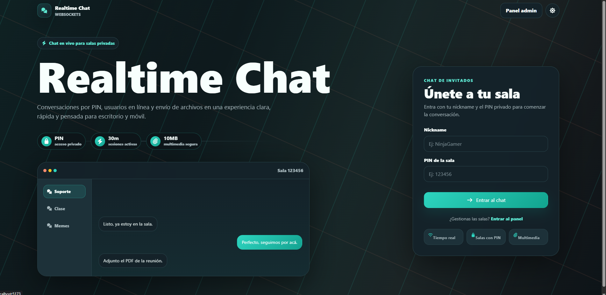
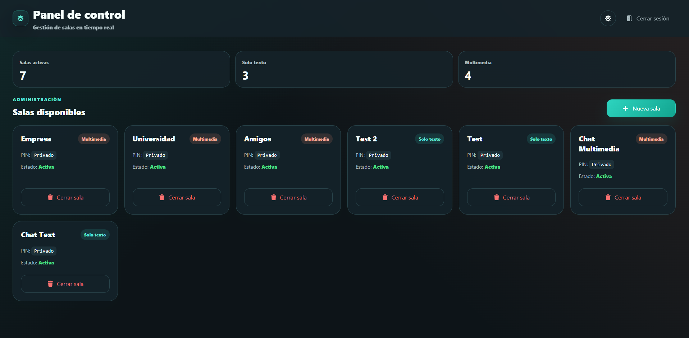
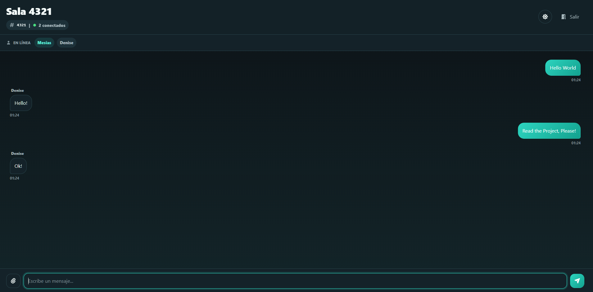
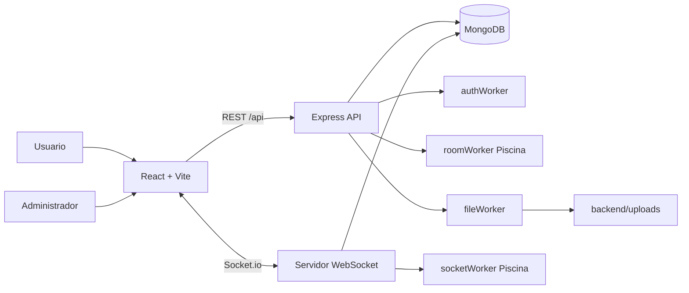
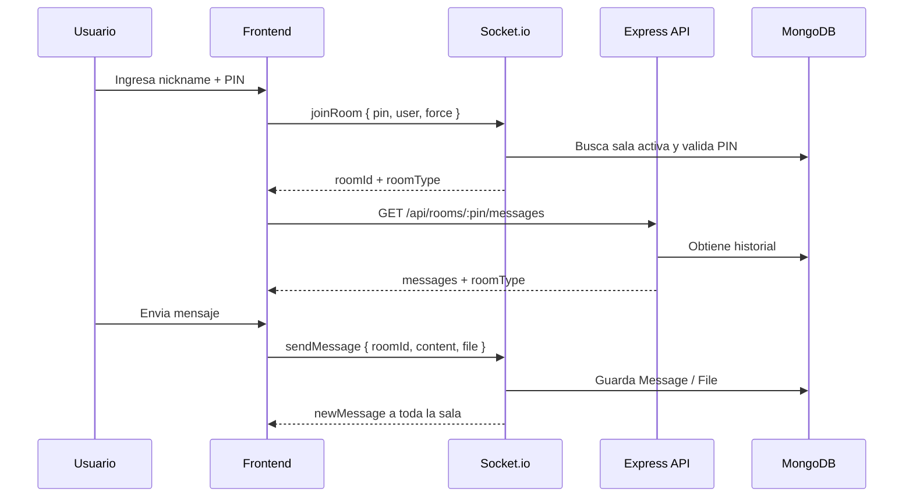
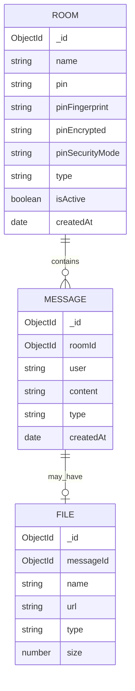

# Realtime Chat WebSockets

<p align="center">
  
  
  
  
  
  
</p>

Sistema web de chat en tiempo real con salas privadas por PIN, panel de administracion, soporte multimedia y procesamiento concurrente con Worker Threads.

El proyecto une una API REST con un servidor WebSocket, persistencia en MongoDB, autenticacion JWT para administradores, salas `TEXT` y `MULTIMEDIA`, carga de archivos, modo oscuro, interfaz responsive y una experiencia cuidada para escritorio y movil.

---

## Vista Rapida

| Modulo | Descripcion |
|---|---|
| Frontend | React 19, Vite 6, Tailwind CSS 4, React Router, Axios, Socket.io Client |
| Backend | Node.js, Express 5, Socket.io 4, Mongoose 9, Multer |
| Seguridad | Admin en MongoDB con bcrypt, JWT revocable, PIN con bcrypt, HMAC y modo opcional AES-GCM |
| Concurrencia | Piscina + Worker Threads |
| Base de datos | MongoDB |
| Pruebas | Jest, Supertest, socket.io-client |

### Lo que hace

- Crea salas privadas desde un panel administrador.
- Permite entrar a salas por PIN y nickname.
- Envia mensajes en tiempo real con Socket.io.
- Guarda historial de mensajes en MongoDB.
- Soporta salas solo texto y salas multimedia.
- Permite imagenes y PDF de hasta 10 MB en salas `MULTIMEDIA`.
- Muestra usuarios conectados en vivo.
- Controla conflictos de sesion por IP/dispositivo.
- Desconecta usuarios por inactividad despues de 30 minutos.
- Usa workers para tareas costosas sin bloquear el hilo principal.
- Incluye landing redisenada, modo claro/oscuro y experiencia movil.

---

## Capturas

### Landing e ingreso



### Panel administrador



### Sala de chat



---

## Tabla de Contenido

- [Arquitectura](#arquitectura)
- [Stack Tecnologico](#stack-tecnologico)
- [Estructura del Proyecto](#estructura-del-proyecto)
- [Instalacion](#instalacion)
- [Variables de Entorno](#variables-de-entorno)
- [Uso de la Aplicacion](#uso-de-la-aplicacion)
- [API REST](#api-rest)
- [Eventos WebSocket](#eventos-websocket)
- [Modelo de Datos](#modelo-de-datos)
- [Seguridad](#seguridad)
- [Workers y Concurrencia](#workers-y-concurrencia)
- [Frontend y UX](#frontend-y-ux)
- [Pruebas](#pruebas)
- [Auditoria y Rendimiento](#auditoria-y-rendimiento)
- [Docker](#docker)
- [Acceso desde Celular](#acceso-desde-celular)
- [Troubleshooting](#troubleshooting)
- [Documentacion Complementaria](#documentacion-complementaria)

---

## Arquitectura



### Flujo principal



El backend mantiene sesiones activas en memoria con `Map`, mientras MongoDB guarda datos persistentes: salas, mensajes y archivos.

---

## Stack Tecnologico

### Backend

| Tecnologia | Uso |
|---|---|
| Node.js | Runtime del servidor |
| Express 5 | API REST |
| Socket.io 4 | Comunicacion en tiempo real |
| Mongoose 9 | Modelado de datos con MongoDB |
| bcrypt | Hash seguro de PIN |
| jsonwebtoken | Autenticacion de administrador |
| multer | Subida de archivos |
| Piscina | Pool de Worker Threads |
| Jest + Supertest | Pruebas automatizadas |

### Frontend

| Tecnologia | Uso |
|---|---|
| React 19 | UI y componentes |
| Vite 6 | Dev server y build |
| Tailwind CSS 4 | Estilos |
| React Router 7 | Rutas de la app |
| Axios | Peticiones HTTP |
| Socket.io Client | Conexion WebSocket |
| SweetAlert2 | Alertas y confirmaciones |
| Font Awesome | Iconografia |

---

## Estructura del Proyecto

```text
realtime-chat-websockets/
├── backend/
│   ├── main.js                  # Express + Socket.io + Piscina
│   ├── seed.js                  # Datos de ejemplo
│   ├── controllers/
│   │   ├── authController.js
│   │   └── roomController.js
│   ├── middlewares/
│   │   └── authMiddleware.js
│   ├── models/
│   │   ├── Room.js
│   │   ├── Message.js
│   │   └── File.js
│   ├── routes/
│   │   ├── authRoutes.js
│   │   ├── roomRoutes.js
│   │   └── uploadRoutes.js
│   ├── tests/
│   ├── uploads/
│   └── workers/
│       ├── authWorker.js
│       ├── fileWorker.js
│       ├── roomWorker.js
│       └── socketWorker.js
├── frontend/
│   ├── vite.config.js
│   └── src/
│       ├── App.jsx
│       ├── context/
│       ├── assets/
│       └── components/
│           ├── atoms/
│           ├── molecules/
│           ├── organisms/
│           └── templates/
├── docs/
├── images/
└── README.md
```

---

## Instalacion

### Requisitos

- Node.js 18 o superior.
- npm.
- MongoDB local o Docker.
- Git.

### 1. Instalar dependencias

```bash
cd realtime-chat-websockets

cd backend
npm install

cd ../frontend
npm install
```

### 2. Levantar MongoDB

Con MongoDB local:

```bash
mongod
```

Con Docker:

```bash
docker run --name realtime-chat-mongo -d -p 27017:27017 mongo:latest
```

### 3. Crear variables de entorno

Crea `backend/.env` y `frontend/.env` con los ejemplos de la siguiente seccion.

### 4. Ejecutar backend

```bash
cd backend
node main.js
```

Servidor:

```text
http://localhost:3000
```

### 5. Ejecutar frontend

En otra terminal:

```bash
cd frontend
npm run dev
```

Aplicacion:

```text
http://localhost:5173
```

---

## Variables de Entorno

### `backend/.env`

```env
PORT=3000
MONGO_URI=mongodb://localhost:27017/realtime-chat
JWT_SECRET=una_clave_larga_y_segura
ADMIN_USER=admin
ADMIN_PASS=admin123
PIN_PEPPER=otra_clave_larga_para_huella_de_pins
```

| Variable | Obligatoria | Descripcion |
|---|---:|---|
| `PORT` | No | Puerto del backend. Por defecto `3000`. |
| `MONGO_URI` | Si | Conexion a MongoDB. |
| `JWT_SECRET` | Si | Firma y verificacion del token admin. |
| `ADMIN_USER` | Si | Usuario del panel administrador. |
| `ADMIN_PASS` | Si | Password del panel administrador. |
| `PIN_PEPPER` | Si | Clave privada para crear huellas HMAC de PIN. |

> `PIN_PEPPER` es obligatorio. Si no existe, el modelo `Room` detiene el backend para evitar guardar PINs sin huella segura.

### `frontend/.env`

```env
VITE_SOCKET_URL=http://localhost:3000
```

| Variable | Descripcion |
|---|---|
| `VITE_SOCKET_URL` | URL del servidor Socket.io y base para archivos subidos. |

La API REST usa rutas relativas `/api` y Vite las redirige al backend mediante el proxy configurado.

---

## Uso de la Aplicacion

### Administrador

1. Abre la app en el navegador.
2. Entra a `/admin`.
3. Inicia sesion con `ADMIN_USER` y `ADMIN_PASS`.
4. Crea una sala con:
   - Nombre.
   - PIN numerico de minimo 4 digitos.
   - Tratamiento del PIN: visible en panel o maxima seguridad.
   - Tipo `TEXT` o `MULTIMEDIA`.
5. Comparte el PIN con los usuarios.

Si se elige **Visible en panel**, el backend guarda el hash bcrypt para validar acceso y una copia cifrada AES-GCM para mostrar el PIN al admin. Si se elige **Maxima seguridad**, solo guarda bcrypt y `pinFingerprint`; el PIN no se puede recuperar ni mostrar despues.

### Usuario

1. Abre `/`.
2. Ingresa nickname.
3. Ingresa PIN de sala.
4. Entra al chat.
5. Chatea en tiempo real.
6. Si la sala es `MULTIMEDIA`, adjunta imagenes o PDF.

### Seed de datos

```bash
cd backend
node seed.js
```

El seed limpia datos anteriores y crea salas/mensajes de ejemplo. Requiere `backend/.env` configurado.
Tambien crea el administrador de prueba con `ADMIN_USER` y `ADMIN_PASS`, guardando la contrasena hasheada en MongoDB.

---

## API REST

Base local:

```text
http://localhost:3000
```

| Metodo | Ruta | Auth | Proposito |
|---|---|---|---|
| `GET` | `/` | No | Health check de la API. |
| `POST` | `/api/auth/login` | No | Login admin y emision de JWT. |
| `POST` | `/api/auth/logout` | JWT | Cierra sesion e invalida el token actual. |
| `POST` | `/api/rooms` | JWT | Crea sala. |
| `GET` | `/api/rooms` | JWT | Lista salas y muestra el PIN solo si la sala usa modo recuperable. |
| `DELETE` | `/api/rooms/bulk` | JWT | Elimina varias salas seleccionadas o todas. |
| `DELETE` | `/api/rooms/:id` | JWT | Elimina sala y mensajes asociados. |
| `GET` | `/api/rooms/:pin/messages` | No | Obtiene historial y tipo de sala. |
| `POST` | `/api/upload` | No | Sube archivo permitido. |

### Login admin

```http
POST /api/auth/login
Content-Type: application/json
```

```json
{
  "username": "admin",
  "password": "admin123"
}
```

Respuesta:

```json
{
  "message": "Autenticación exitosa (procesada en hilo independiente)",
  "token": "<jwt>"
}
```

### Crear sala

```http
POST /api/rooms
Authorization: Bearer <jwt>
Content-Type: application/json
```

```json
{
  "name": "Sala de soporte",
  "pin": "1234",
  "pinSecurityMode": "RECOVERABLE",
  "type": "MULTIMEDIA"
}
```

`pinSecurityMode` acepta:

- `RECOVERABLE`: valida con bcrypt y guarda una copia cifrada AES-GCM para mostrar el PIN en el panel admin.
- `NON_RECOVERABLE`: valida con bcrypt y no guarda copia reversible; el PIN no se podra recuperar.

Respuesta:

```json
{
  "message": "Sala creada exitosamente",
  "room": {
    "_id": "...",
    "name": "Sala de soporte",
    "pin": "1234",
    "pinSecurityMode": "RECOVERABLE",
    "pinCanBeRecovered": true,
    "type": "MULTIMEDIA",
    "isActive": true
  }
}
```

### Subir archivo

```http
POST /api/upload
Content-Type: multipart/form-data
```

Campo:

```text
file
```

Formatos permitidos:

- `image/jpeg`
- `image/jpg`
- `image/png`
- `image/gif`
- `application/pdf`

Limite:

```text
10 MB
```

---

## Eventos WebSocket

Conexion por defecto:

```text
http://localhost:3000
```

### Cliente a servidor

| Evento | Payload | Descripcion |
|---|---|---|
| `joinRoom` | `{ pin, user, force }` | Une al usuario a una sala validando PIN, nickname y sesion. |
| `sendMessage` | `{ roomId, content, file }` | Envia texto o archivo a la sala. |
| `disconnect` | Automatico | Limpia la sesion activa en memoria. |

### Servidor a cliente

| Evento | Payload | Descripcion |
|---|---|---|
| `newMessage` | Mensaje | Mensaje nuevo enviado a todos los usuarios de la sala. |
| `userListUpdate` | `string[]` | Lista de usuarios conectados. |
| `force_disconnect` | Mensaje | Desconecta una sesion anterior al forzar entrada. |
| `inactivity_timeout` | Mensaje | Desconecta por inactividad. |

---

## Modelo de Datos



### Salas `TEXT`

- Solo texto.
- No muestran boton de adjuntar archivo.
- Ideales para conversaciones rapidas y controladas.

### Salas `MULTIMEDIA`

- Texto y archivos.
- Muestran boton de adjuntar.
- Permiten imagenes y PDF.
- Guardan metadatos del archivo en MongoDB.

---

## Seguridad

| Capa | Implementacion |
|---|---|
| Admin | Usuario en MongoDB con contrasena bcrypt; JWT firmado con `JWT_SECRET`. |
| PIN | bcrypt para validar acceso; AES-GCM opcional solo si la sala usa modo recuperable. |
| Duplicados | HMAC SHA-256 con `PIN_PEPPER` mediante `pinFingerprint`. |
| Middleware | `authMiddleware.js` valida rutas admin. |
| Sesiones | `usuariosConectados` controla socket, usuario, sala e IP. |
| Inactividad | Timeout de 30 minutos por socket. |
| Archivos | Filtro MIME y limite de 10 MB. |
| Logout | `POST /api/auth/logout` revoca el JWT en memoria hasta su expiracion. |
| Headers | CORS, `X-Content-Type-Options`, `X-Frame-Options` y `Referrer-Policy`. |

El PIN de acceso siempre se compara contra el hash guardado usando bcrypt. `pinFingerprint` sirve para detectar PINs duplicados sin guardar el PIN en plano. En modo `RECOVERABLE`, el backend ademas descifra `pinEncrypted` para mostrar el PIN en el panel admin; en modo `NON_RECOVERABLE`, `pinEncrypted` no se guarda y el PIN no se puede recuperar.

---

## Workers y Concurrencia

El proyecto usa dos enfoques:

### Piscina

Para operaciones frecuentes:

- `socketWorker.js`
  - `validateJoin`
  - `filterUsers`
  - `processMessage`
- `roomWorker.js`
  - `verifyRoomPin`

### Worker Thread directo

Para operaciones puntuales:

- `authWorker.js`
  - Firma/verificacion de JWT.
- `fileWorker.js`
  - Procesamiento simulado de archivos.

### Umbral de carga

```js
const HIGH_LOAD_THRESHOLD = 5
```

Si hay mas de 5 usuarios conectados, el procesamiento de mensajes se delega al worker.

---

## Frontend y UX

El frontend esta organizado con Atomic Design:

```text
components/
├── atoms/
├── molecules/
├── organisms/
└── templates/
```

Mejoras incluidas:

- Landing visual con enfoque de producto.
- Panel administrador con metricas y lista de salas.
- Chat full-screen en escritorio.
- Composer optimizado para movil.
- Modo claro/oscuro persistente.
- Context API para tema sin prop drilling.
- Distincion de sala `TEXT` vs `MULTIMEDIA`.
- Previsualizacion de imagenes y enlaces a PDF.
- Progreso de subida.
- Alertas de sesion, errores y confirmaciones con SweetAlert2.

---

## Pruebas

### Backend

```bash
cd backend
npm test
```

Modo watch:

```bash
cd backend
npm run test:watch
```

Suites incluidas:

- Autenticacion.
- Modelo Admin y contrasenas bcrypt.
- Middleware JWT.
- CRUD de salas.
- WebSockets.
- Upload de archivos.
- Workers.

Reporte HTML:

```text
backend/coverage/lcov-report/index.html
```

### Frontend

```bash
cd frontend
npm run lint
npm run build
```

---

## Auditoria y Rendimiento

### Prueba de carga con 50 usuarios

Con el backend activo:

```bash
cd backend
npm run load:test
```

El script crea una sala temporal, conecta 50 clientes Socket.io con `deviceId` distinto, envia mensajes y genera reportes en:

```text
docs/audit/load-test-50-users.md
docs/audit/load-test-50-users.json
```

En Windows, si `localhost` resuelve por IPv6 y el backend esta en IPv4, usa:

```powershell
$env:LOAD_TEST_API_URL="http://127.0.0.1:3000"
cd backend
npm run load:test
```

### Prueba de ambiente local

Desde la raiz del repositorio, con el backend activo:

```bash
node scripts/environmentCheck.js
```

Genera:

```text
docs/audit/environment-smoke.md
```

El reporte valida Node, npm, estructura backend/frontend, `.env.example`, `.env` ignorados por Git, dependencias, build frontend, cobertura y health check.

### Evidencia de auditoria

La hoja de control para entrega esta en:

```text
docs/audit/auditoria-entrega.md
```

Los diagramas de secuencia obligatorios estan en:

```text
docs/sequence-diagrams.md
```

---

## Docker

Levantar todo el sistema con MongoDB, backend y frontend:

```bash
docker compose up --build
```

Servicios:

```text
Frontend: http://localhost:5173
Backend:  http://localhost:3000
MongoDB:  localhost:27017
```

Los datos de MongoDB y los archivos subidos persisten en volumenes Docker.

---

## Acceso desde Celular

1. Obtén la IP de tu equipo en la red local. Ejemplo:

```text
192.168.1.20
```

2. Configura `frontend/.env`:

```env
VITE_SOCKET_URL=http://192.168.1.20:3000
```

3. Levanta backend:

```bash
cd backend
node main.js
```

4. Levanta frontend en red:

```bash
cd frontend
npm run dev -- --host 0.0.0.0
```

5. Abre desde el celular:

```text
http://192.168.1.20:5173
```

Si no carga, revisa firewall, red WiFi y que ambos dispositivos esten conectados a la misma red.

---

## Troubleshooting

### El backend se cierra al iniciar

Revisa que exista `PIN_PEPPER` en `backend/.env`.

### No conecta a MongoDB

Verifica `MONGO_URI` y que MongoDB este activo:

```bash
mongosh
```

Con Docker:

```bash
docker ps
```

### El frontend abre pero el chat no conecta

Revisa `frontend/.env`:

```env
VITE_SOCKET_URL=http://localhost:3000
```

Si estas usando un celular, cambia `localhost` por la IP del equipo.

### No aparece el clip de adjuntar

La sala probablemente es `TEXT`. Solo las salas `MULTIMEDIA` muestran adjuntos.

### No sube archivos

Verifica:

- Que la sala sea `MULTIMEDIA`.
- Que el archivo pese maximo 10 MB.
- Que el formato sea imagen o PDF.
- Que exista `backend/uploads/`.

### Hay conflicto de sesion

El sistema detecta una sesion activa desde la misma IP/dispositivo. Puedes:

- Continuar como el usuario existente.
- Forzar entrada.
- Volver al inicio.

---

## Comandos Utiles

```bash
# Backend
cd backend
npm install
node main.js
npm test
npm run load:test

# Frontend
cd frontend
npm install
npm run dev
npm run build
npm run lint

# Seed
cd backend
node seed.js

# Auditoria local
cd ..
node scripts/environmentCheck.js

# Docker
docker compose up --build
```

---

## Documentacion Complementaria

- [Requisitos del proyecto](./docs/requisitos.md)
- [Modelo de datos](./docs/datamodel/datamodel.md)
- [Diagramas de secuencia](./docs/sequence-diagrams.md)
- [Evidencia de auditoria](./docs/audit/auditoria-entrega.md)
- [Prueba de carga 50 usuarios](./docs/audit/load-test-50-users.md)
- [Prueba de ambiente local](./docs/audit/environment-smoke.md)
- [Contenedores Docker](./docs/containers.md)
- [Presentacion del enunciado](./docs/proyecto_p1.pdf)

---

## Estado del Proyecto

Proyecto desarrollado para la asignatura de Aplicaciones Distribuidas.

Incluye backend, frontend, WebSockets, workers, persistencia, autenticacion, subida de archivos, pruebas, documentacion y una interfaz responsive lista para demostracion.
