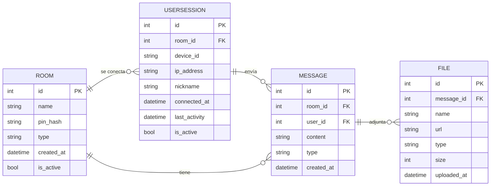

# Modelado de datos v1.0

*23/04/2026*

Modelado de datos para el sistema de mensajería, **se asume que el administrador es único** y se siguen las siguientes reglas:

- El administrador crea salas (`Room`) y el id de sala (`Room.id`) se genera automáticamente.
- Si la sala es tipo texto ('TEXT'), solo permite el envío de mensajes de texto
- Si la sala es tipo multimedia ('MULTIMEDIA'), permite el envío de mensajes de texto y archivos con límite de tamaño configurable.
- El usuario (`UserSession`) se une a la sala mediante el pin de sala y un nickname.
- El nickname del usuario (`UserSession.nickname`) es único dentro de la sala.
- El dispositivo del usuario (`UserSession.device`) solo puede estar unido a una sala a la vez.

## Entidades

### Room

- `id`: identificador único de la sala (PK, generado automáticamente)
- `name`: nombre de la sala (string)
- `pin_hash`: hash del PIN de acceso a la sala (string)
- `type`: tipo de sala, puede ser 'TEXT' o 'MULTIMEDIA' (enum)
- `created_at`: fecha y hora de creación de la sala (datetime)
- `is_active`: indica si la sala está activa (boolean)

### UserSession

- `id`: identificador único de la sesión (PK, generado automáticamente)
- `room_id`: referencia a la sala (`Room`) (FK, uuid)
- `device_id`: identificador único del dispositivo (string)
- `ip_address`: dirección IP del usuario (string)
- `nickname`: apodo del usuario en la sesión (string)
- `connected_at`: fecha y hora de conexión (datetime)
- `last_activity`: fecha y hora de la última actividad, como mensaje o inicio se sesión (datetime)
- `is_active`: indica si la sesión está activa (boolean)

### Message

- `id`: identificador único del mensaje (PK, generado automáticamente)
- `room_id`: referencia a la sala (`Room`) (FK, uuid)
- `user_id`: referencia a la sesión de usuario (`UserSession`) (FK, uuid)
- `content`: contenido del mensaje (texto o referencia a archivo) (string)
- `type`: tipo de mensaje, puede ser 'TEXT' o 'FILE' (enum)
- `created_at`: fecha y hora de creación del mensaje (datetime)

### File

- `id`: identificador único del archivo (PK, generado automáticamente)
- `message_id`: referencia al mensaje (`Message`) (FK, uuid)
- `name`: nombre del archivo (string)
- `url`: URL de almacenamiento/acceso al archivo (string)
- `type`: tipo MIME o extensión del archivo (string)
- `size`: tamaño del archivo en bytes (int)
- `uploaded_at`: fecha y hora de subida del archivo (datetime)

> Los atributos finales de `File` se tienen que contemplar más adelante

## Diagrama ER

## Por definir (dudas)

- ¿El administrador es único? ¿Hay más de un administrador?
  - Según las respuestas, se crea o no la tabla `Admin`.
- ¿El usuario necesita el id de sala? ¿El administrador invita al usuario?
  - Según las respuestas, se pide o no un id de sala para que el usuario ingrese a una sala