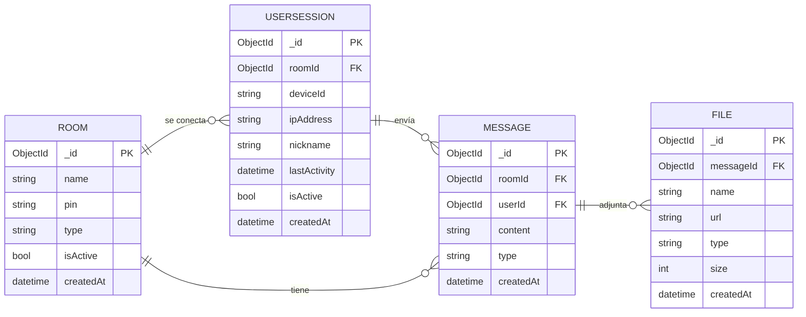

# Modelado de datos v1.0.2

*28/04/2026*

Modelado de datos para el sistema de mensajería, para el que se siguen las siguientes reglas:

- El administrador es único.
- El administrador crea salas (`Room`) y el id de sala (`Room._id`) se genera automáticamente.
- Si la sala es tipo texto ('TEXT'), solo permite el envío de mensajes de texto
- Si la sala es tipo multimedia ('MULTIMEDIA'), permite el envío de mensajes de texto y archivos con límite de tamaño configurable.
- El usuario (`UserSession`) se une a la sala mediante el pin de sala, que identifica a cada sala.
- El nickname del usuario (`UserSession.nickname`) es único dentro de la sala.
- El dispositivo del usuario (`UserSession.deviceId`) solo puede estar unido a una sala a la vez.

## Entidades

### Room

- `_id`: identificador único de la sala (PK, generado automáticamente)
- `name`: nombre de la sala (string)
- `pin`: PIN de acceso a la sala (string, generado automáticamente)
- `type`: tipo de sala, puede ser 'TEXT' o 'MULTIMEDIA' (enum)
- `isActive`: indica si la sala está activa (boolean)
- `createdAt`: fecha y hora de creación de la sala (datetime, generado automáticamente)

### UserSession

- `_id`: identificador único de la sesión (PK, generado automáticamente)
- `roomId`: referencia a la sala (`Room`) (FK, ObjectId)
- `deviceId`: identificador único del dispositivo (string)
- `ipAddress`: dirección IP del usuario (string)
- `nickname`: apodo del usuario en la sesión (string)
- `lastActivity`: fecha y hora de la última actividad, como mensaje o inicio de sesión (datetime)
- `isActive`: indica si la sesión está activa (boolean)
- `createdAt`: fecha y hora de conexión (datetime, generado automáticamente)

### Message

- `_id`: identificador único del mensaje (PK, generado automáticamente)
- `roomId`: referencia a la sala (`Room`) (FK, ObjectId)
- `userId`: referencia a la sesión de usuario (`UserSession`) (FK, ObjectId)
- `content`: contenido del mensaje (texto o referencia a archivo) (string)
- `type`: tipo de mensaje, puede ser 'TEXT' o 'FILE' (enum)
- `createdAt`: fecha y hora de creación del mensaje (datetime, generado automáticamente)

### File

- `_id`: identificador único del archivo (PK, generado automáticamente)
- `messageId`: referencia al mensaje (`Message`) (FK, ObjectId)
- `name`: nombre del archivo (string)
- `url`: URL de almacenamiento/acceso al archivo (string)
- `type`: tipo MIME o extensión del archivo (string)
- `size`: tamaño del archivo en bytes (int)
- `createdAt`: fecha y hora de subida del archivo (datetime, generado automáticamente)

> Los atributos finales de `File` se tienen que contemplar más adelante

## Diagrama ER

## Por definir (dudas)

*Ninguna duda*