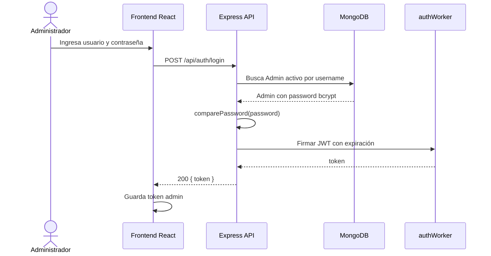
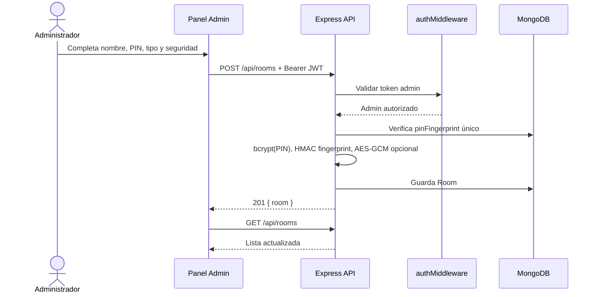
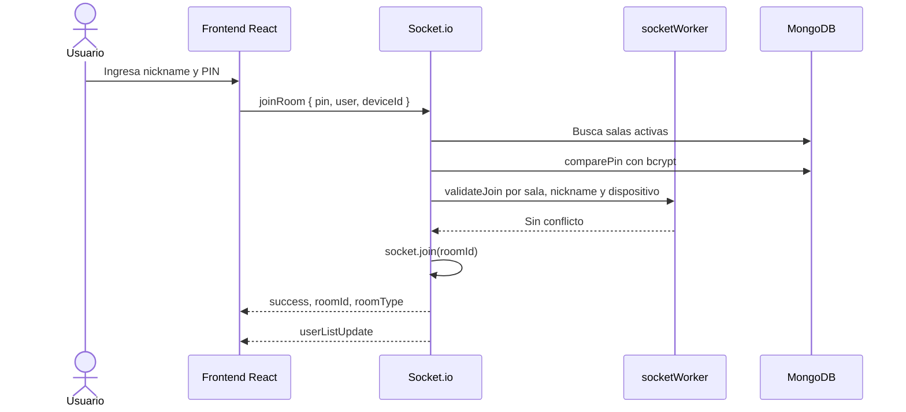
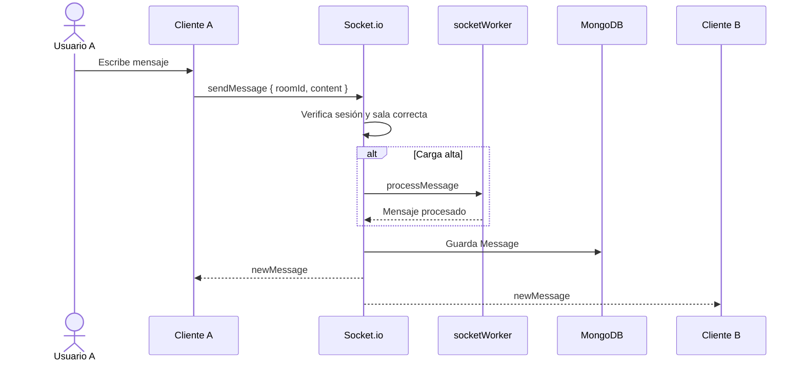
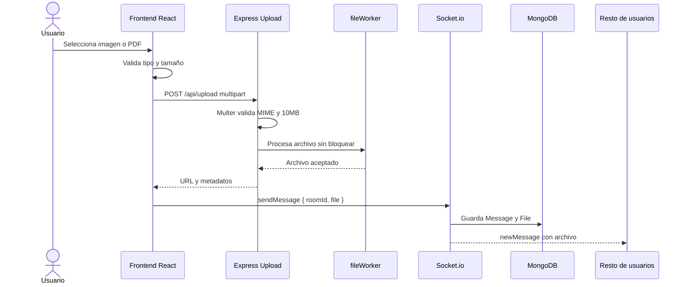
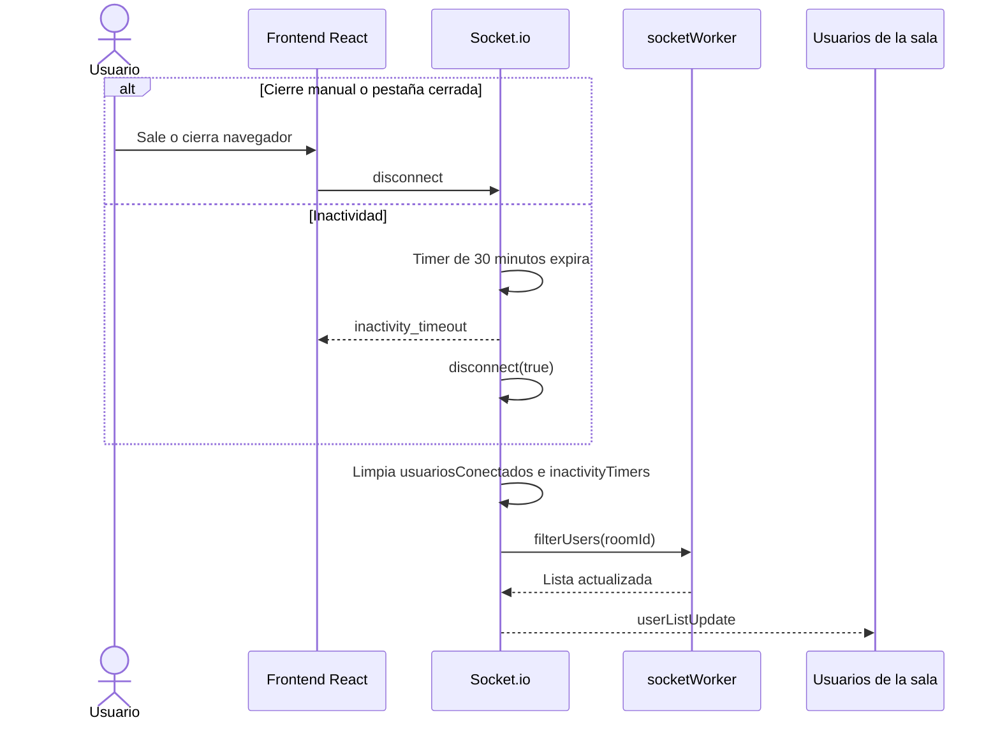

# Diagramas de secuencia

Diagramas Mermaid para validar los flujos obligatorios del sistema.

## Login del administrador

## Creación de sala por el administrador

## Acceso de usuario con PIN y nickname

## Envío y recepción de mensaje en tiempo real

## Subida de archivo en sala multimedia

## Desconexión de usuario

